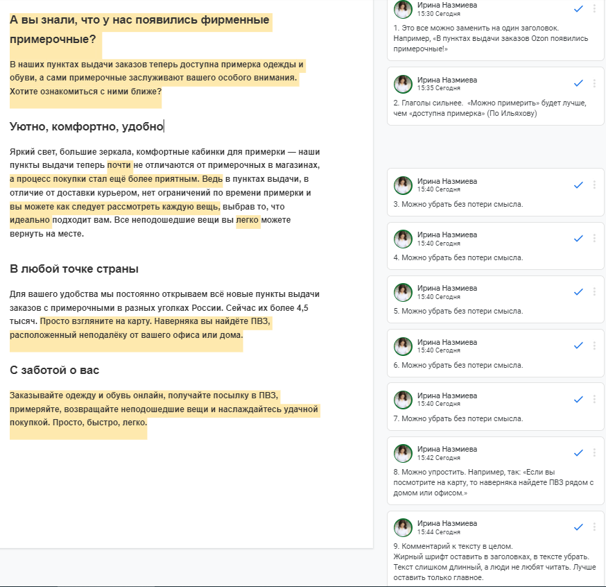

## Обратная связь

**Возможные исправления**

Текст можно сократить без потери смысла, чтобы легко и быстро читался. Жирный шрифт оставить только у заголовков.
Сократить количество личных местоимений, которые не влияют на смысл. Например,
"В наших пунктах выдачи заказов ...", "... наши пункты выдачи...". Лучше написать пункт выдачи Ozon.

Первый абзац можно сделать одним заголовком: "В пунктах выдачи заказов Ozon появились примерочные!". Смысл тот же, но читать меньше.
Детальные исправления есть [Google Docs](https://docs.google.com/document/d/1ISJ7gMspReyiWbUHpoaA_5hwVwDjj_FIb7QeBaG5vf4/edit?usp=sharing).

